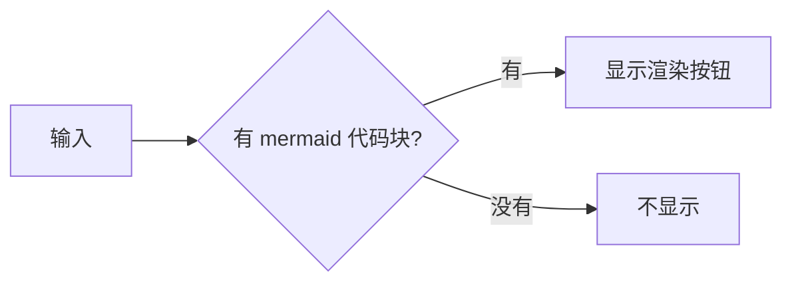

# @local/dsh-mermaid-viewer

一个 profile bundle：给**模型这一轮回复的最后一条消息**加一个「渲染 Mermaid」按钮，
点一下才在浮层里把回复中的 ` ```mermaid ` 代码块画成图。

- 不实时渲染：流式输出期间不碰 mermaid，代码块照旧是普通代码块。
- 不自动渲染：只有你点击按钮时才加载 mermaid 并绘制。
- 只认最终回复：按钮挂在 `conversation.chat.assistant-actions`（每轮定稿的最后一条
  assistant 消息的动作行），中间步骤的消息不参与。
- 没有 `mermaid` 代码块的消息不会出现按钮。
- 每张图独立缩放：浮层里每张图自带缩放视口（滚轮/按钮缩放、拖拽平移、适应窗口），
  还可以把**单张图**全屏查看。

## 工作原理

| 半边 | 位置 | 做什么 |
|---|---|---|
| Host | `index.js` | 注册 `mermaidDiagrams` session projection：把每条 `assistant/message` 的 text 块里围栏为 `mermaid` 的代码块抽出来，折叠成 `{ messageId: string[] }`，随 projection 机制送到浏览器并写入投影缓存。 |
| Client | `client.js` | `conversation.chat.assistant-actions` 里按 `messageId` 读投影值决定是否显示按钮；`shell.overlay` 里挂一个浮层查看器，点击后 `require.async('./client.mermaid.js')` 懒加载 mermaid，逐张 `parse` + `render` 成 SVG，每张 SVG 交给一个自带缩放视口的卡片。 |
| 资源 | `client.mermaid.js` | vendored 的 mermaid 11.16.0 浏览器构建（MIT，见 `NOTICE`），按 DSH Client 模块加载器的包内 chunk 协议包装。 |

浏览器半边不自己折会话日志（那是 Host projection 的职责），也不 import 任何
Harness Client 包：控件、样式（只用 `--dsw-alias-*` token）、modal 行为都自带，
文案走 `ctx.locale` 的 `dsh-mermaid-viewer` 命名空间。

## 使用

安装后无需配置。让模型在**最终回复**里写一个围栏代码块：

````markdown

````

该轮结束后，回复下方的动作行（复制/分支那一排）里会出现一个流程图图标按钮，
点击打开浮层；Esc、点遮罩或右上角 ✕ 关闭。多张图会依次排布在同一个浮层里。

### 单张图的缩放与全屏

每张图的右上角常驻一个小工具栏：`−`、当前百分比、`+`、适应窗口、全屏。

| 操作 | 浮层内 | 全屏时 |
|---|---|---|
| 缩放 | `Ctrl`/`Cmd` + 滚轮（普通滚轮留给图片列表滚动），或 `−`/`+` | 滚轮直接缩放（此时没有可滚动的内容） |
| 平移 | 内容大于视口时按住左键拖拽 | 同左 |
| 适应窗口 ↔ 100% | 双击图面切换，或点「适应窗口」 | 同左 |
| 全屏 | 点全屏按钮（`requestFullscreen`，作用于这一张图） | 点同一按钮退出，或按 Esc |

缩放范围 25%–400%，步进 25%，与文档预览的缩放控件一致。全屏时 Esc 由浏览器先接管
（退出全屏），再按一次才关闭浮层；关闭浮层或切换消息时缩放状态复位。

## 重新生成 vendored chunk

`client.mermaid.js` 由脚本生成，不要手改：

```sh
node scripts/build-mermaid-chunk.mjs            # 默认取 DSH checkout 里的 mermaid
DSH_MERMAID_ROOT=/path/to/checkout node scripts/build-mermaid-chunk.mjs
node scripts/build-mermaid-chunk.mjs /path/to/mermaid.min.js
```

脚本会：读取 mermaid 的 `dist/mermaid.min.js`，断言它仍以
`globalThis["mermaid"] = globalThis.__esbuild_esm_mermaid_nm["mermaid"].default;`
结尾（换 mermaid 版本时若这句没了会直接报错，不会静默生成坏 chunk），删掉这一行，
把 IIFE 包进 `window.__ModuleLoader__.load({ id, chunk, factory })`，并返回
`__esbuild_esm_mermaid_nm["mermaid"].default`，因此不会在页面上留下 `globalThis.mermaid`。
最后 touch 一次 `client.js`：bundle rev 由 `client.js` 的 mtime/ctime/size 计算，
chunk URL 用它做不可变缓存键，不 touch 就会继续命中旧 chunk。

## 本地检查

```sh
node --check index.js && node --check client.js
node scripts/test-host-fold.mjs        # 围栏抽取与 projection 状态迁移
node scripts/smoke-mermaid-chunk.mjs   # chunk 注册、API 形状、parse（渲染需要真实浏览器）
node scripts/smoke-diagram-card.mjs    # 卡片视口：适应比例、缩放步进、双击切换、全屏调用、Esc 关闭
```

`smoke-mermaid-chunk.mjs` 用 jsdom，只能验证到 `mermaid.parse`：mermaid 用
`getBBox` 量测已布局的 SVG，jsdom 没有实现，真正的绘制必须在浏览器里确认。
`smoke-diagram-card.mjs` 同样跑在 jsdom 里，由测试补上 jsdom 不实现的布局与 SVG 几何
（`viewBox`、`clientWidth`/`clientHeight`、`ResizeObserver`、`requestFullscreen`），
因此它验证的是缩放算术与交互接线，不是绘制效果。

## 已知边界

- 浮层没有焦点陷阱（host 的 Modal 有），只有 Esc/遮罩/关闭按钮三种退出方式。
- 缩放视口没有实现双指捏合：触屏上靠 `−`/`+` 和双击，触控板捏合（浏览器合成的
  `Ctrl`+滚轮）可用。
- 没有实现"在新标签页打开"：桌面端的 `setWindowOpenHandler` 只放行 http/https
  （`blob:` 会被拒），浏览器端又拿不到可托管的 http 地址，所以全屏是唯一的放大视图。
- 工具栏按钮只有原生 `title` 提示，没有用 host 的 Tooltip 原语（动态插件不能 import
  `ui-primitives`）。
- mermaid 主题按画布 token（`--dsw-alias-bg-base`）的亮度在 `dark`/`default` 之间二选一，
  不跟随自定义主题的强调色。
- 只抽取 text 块；reasoning（思考）块里的 mermaid 代码块不渲染。
- 图片型输出（比如 mermaid 生成的 SVG 想给模型看）不在此插件范围内：渲染只发生在浏览器，
  模型看不到图。
